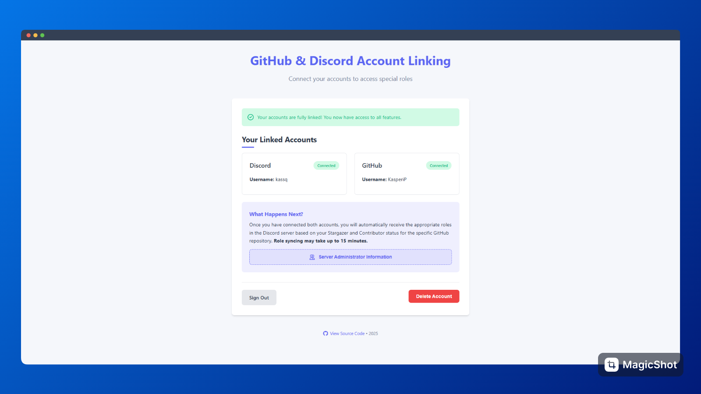

# Discord GitHub Roles

Automatically assign Discord roles based on GitHub contributions and stars! This bot helps you reward your GitHub contributors and stargazers with special roles in your Discord server.



## 🌟 Features

- **Automatic Role Assignment**: Sync roles based on GitHub activity
- **Contributors Recognition**: Reward users who contribute to your repositories
- **Stargazers Rewards**: Give special roles to users who star your repositories
- **Multiple Repositories**: Support for monitoring multiple GitHub repositories per Discord server
- **Simple Web Interface**: Easy account linking for users
- **Regular Syncing**: Keeps roles up-to-date automatically (every 15 minutes)

## 🚀 Getting Started

### Prerequisites

- Node.js (v18 or newer)
- npm or pnpm package manager
- Discord Bot Token and Application
- GitHub OAuth Application

### Setup

1. **Clone the repository**
   ```bash
   git clone https://github.com/KasperiP/discord-github-roles.git
   cd discord-github-roles
   ```

2. **Install dependencies**
   ```bash
   pnpm install
   # or
   npm install
   ```

3. **Set up the environment**
   
   Copy the `.example.env` file to `.env`:
   ```bash
   cp .example.env .env
   ```
   
   Then update it with your credentials:
   ```
   DATABASE_URL="file:./dev.db"
   
   DISCORD_TOKEN=YOUR_DISCORD_TOKEN_HERE
   
   # OAuth credentials
   DISCORD_CLIENT_ID=YOUR_DISCORD_CLIENT_ID_HERE
   DISCORD_CLIENT_SECRET=YOUR_DISCORD_CLIENT_SECRET_HERE
   
   GITHUB_CLIENT_ID=YOUR_GITHUB_CLIENT_ID_HERE
   GITHUB_CLIENT_SECRET=YOUR_GITHUB_CLIENT_SECRET_HERE
   
   BASE_URL=http://localhost:3000
   
   NODE_ENV=development
   JWT_SECRET=YOUR_JWT_SECRET_HERE
   ```

4. **Set up the database**
   ```bash
   pnpm gen
   # or
   npm run gen
   ```

5. **Build and start the application**
   ```bash
   # Development mode
   pnpm dev
   
   # Production mode
   pnpm build && pnpm start
   ```

## 📝 Discord Commands

After adding the bot to your Discord server, you can configure it using the following commands:

### Role Management

- `/setup-contributor-role` - Set a role for GitHub contributors
- `/remove-contributor-role` - Remove the contributor role setting
- `/setup-stargazer-role` - Set a role for GitHub repository stargazers
- `/remove-stargazer-role` - Remove the stargazer role setting

### Repository Management

- `/follow-repository` - Add a GitHub repository to follow for role assignments
- `/unfollow-repository` - Remove a GitHub repository from being followed
- `/list-repositories` - List all followed GitHub repositories
- `/show-config` - Display current role configuration

## 🔐 Security

- Role commands require administrator permissions in Discord
- JWT-based authentication for the web interface
- CSRF protection for OAuth flows
- Secure cookie management with HttpOnly flags

## 👥 How Users Link Accounts

1. Users visit your hosted application URL
2. They can connect their Discord account using the OAuth flow
3. They can connect their GitHub account using the GitHub OAuth flow
4. Once both accounts are connected, roles are automatically assigned

## 🏗️ Architecture

- **Frontend**: Simple HTML/JSX interface using Hono.js
- **Backend**: Node.js with TypeScript
- **Database**: Prisma ORM with SQLite (can be configured for other databases)
- **Bot**: Discord.js for bot functionality
- **Web Server**: Hono.js for handling routes and OAuth flows

## 📊 Development

### Scripts

- `pnpm dev` - Start development server with hot reload
- `pnpm build` - Build the application
- `pnpm start` - Run the built application
- `pnpm gen` - Generate Prisma client

## 🤝 Contributing

Contributions are welcome! Feel free to open an issue or submit a pull request.

## 📄 License

This project is licensed under the MIT License.

